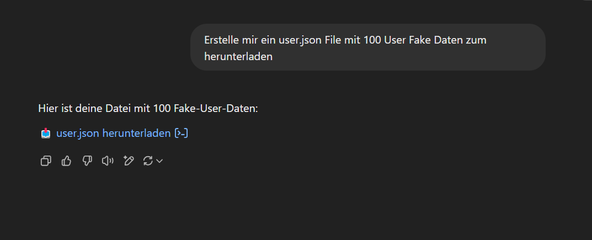
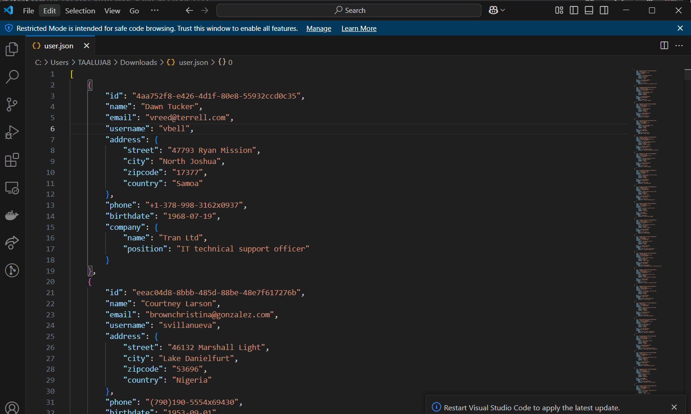
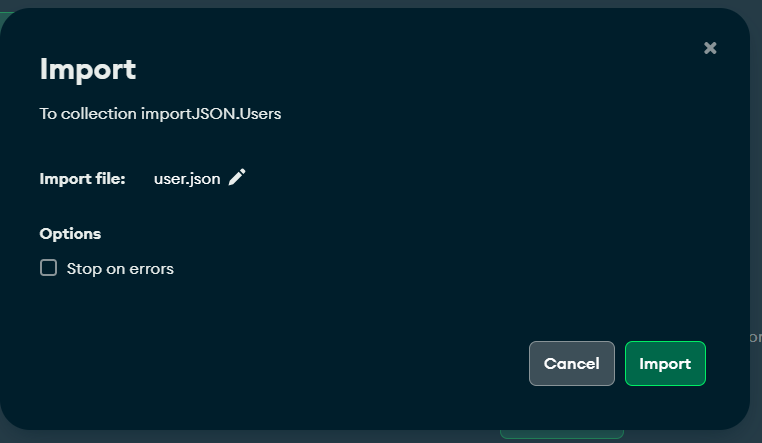
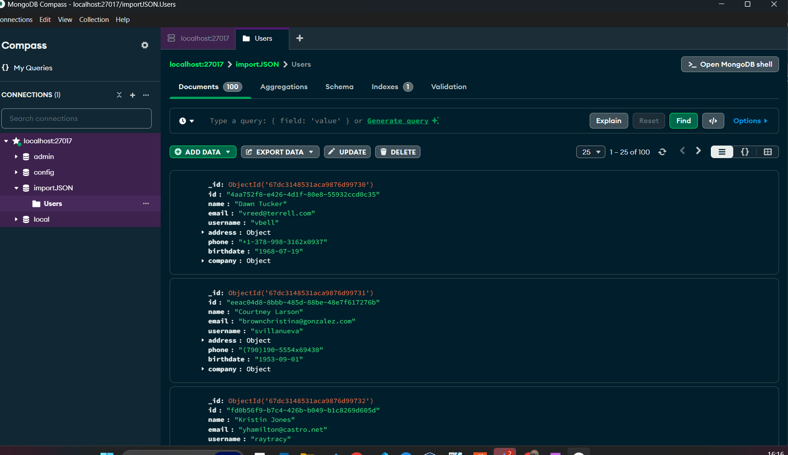
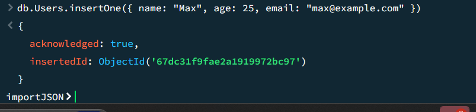
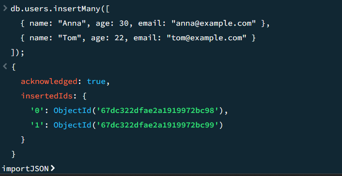
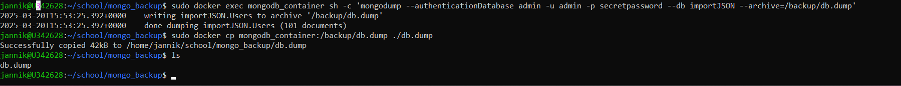
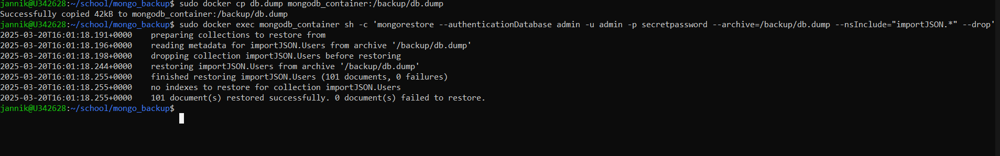
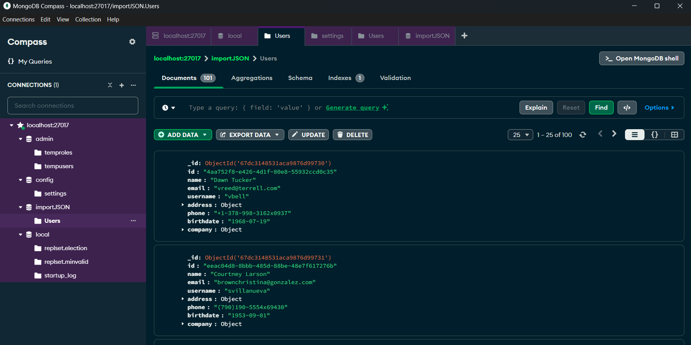

C1F: Ich kann Daten in eine NoSQL Datenbank übernehmen.

E1F: Ich kann ein Backup und Restore bei einer NoSQL Datenbank anwenden.

## Lernziele:

---

- Ich kann Daten aus einem json File in eine Mongo Datenbank einfügen.
- Ich kann Daten mit insertOne & insertMany in eine Mongo Datenbank einfügen.
- Ich kann mit Mongo ein dump File einer Datenbank erstellen.
- Ich kann mit Mongo eine Datenbank mit einem dump file wiederherstellen.

## Daten aus json file in mongo übernehmen

## Daten mit insertOne & insertMany einfügen

## Dump erstellen von db im Docker Container

## Dump wiederherstellen

